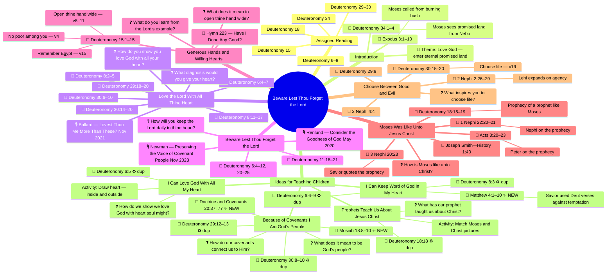

    Youth Theme Connections
      🔵 AP Theme — HIGH
        With all my heart might mind and strength
          = Deuteronomy 6:5 verbatim restatement
        Keep His commandments beginning in my home
          = Deuteronomy 6:6–9
        Make and keep temple covenants
          = Deuteronomy 29:12–13
      🟡 YW Theme — HIGH
        Make and keep sacred covenants
          = Children section 4 covenants
        Strengthen my home and family
          = Deuteronomy 6:6–9
      🟢 Annual Theme 2025
        I Can Do All Things Through Christ
          = Choose life Deuteronomy 30:19
    FSY Connections
      ⭐ Ch 6 — Love God love your neighbor
        Header: Matthew 22:37–40
          Jesus quoting Deuteronomy 6:5 the Shema
        Loving God begins at home
          = Deuteronomy 6:6–9
        Open hand wide to all neighbors
          = Deuteronomy 15 helping the poor
      ⭐ Ch 7 — Ordinances and Covenants
        Covenants as mutual agreements with God
          = Deuteronomy 29:12–13
        Baptismal covenant promises
          = Mosiah 18:8–10
      Ch 2 — God wants to communicate
        Spirit speaks to mind and heart
          = Deuteronomy 6:6 in thine heart
```

## Legend
- 📖 Scripture reference
- ❓ Discussion question  
- 🎙 Conference talk
- 🎵 Hymn
- ♻ dup — Also appears in main lesson (duplicate)
- ✨ NEW — Only appears in children section (not in main lesson)

## Key Themes for Teaching
1. **The Heart** — inward loyalty vs. outward ritual (runs through every section)
2. **Remembrance** — active daily practices to not forget God
3. **Covenant Identity** — belonging to God's people through promises
4. **Moses as Type of Christ** — the great prophetic foreshadowing
5. **Agency** — choose life (Deut 30:19) connects to Lehi's teachings in 2 Nephi 2

## Key Cross-Reference Connections

| Source | Phrase | Lesson Section | Why It Matters |
|--------|--------|----------------|----------------|
| **AP Quorum Theme** | "With all my heart, might, mind, and strength, I will love God" | Love the Lord (§1) | Direct restatement of Deuteronomy 6:5. Every young man reciting this theme is quoting Moses. |
| **FSY Ch. 6** | Header: Matthew 22:37–40 | Love the Lord (§1) | Jesus quoting the Shema — same commandment across 3 eras: Moses → Jesus → youth today |
| **AP Theme + FSY Ch. 6** | Both point to Deut 6:5 | Love the Lord (§1) | Triple-source convergence — excellent game question: "Name something the AP Theme, FSY, and Deuteronomy all say to do" |
| **YW Theme** | "make and keep sacred covenants" | Covenants (children §4) | YW theme is a modern covenant statement — same structure as Deuteronomy 29:12–13 |
| **AP Theme** | "make and keep temple covenants" | Covenants (children §4) | Same as above — both themes reinforce the covenant lesson |
| **FSY Ch. 7** | Baptismal covenant = mutual agreement | Covenants (children §4) | Connects D&C 20:37, 77 (already in lesson) to modern youth experience |
| **YW Theme** | "strengthen my home and family" | Beware/Forget (§2) | Moses commanded parents to teach children — YW theme echoes this mandate |
| **FSY Ch. 6** | "Loving God's children begins at home" | Beware/Forget (§2) | Same connection — Deuteronomy 6:6–9 to home and family |
| **FSY Ch. 6** | Helping those who are marginalized | Helping poor (§3) | Extends Deuteronomy 15 "open thine hand wide" to modern application |

## Unique References in Children Section (not in main lesson)
| Reference | Context |
|---|---|
| Matthew 4:1–10 | Jesus used Deuteronomy verses during temptation |
| Mosiah 18:8–10 | Baptismal covenant — we make the same kind of covenant |
| D&C 20:37, 77 | Modern covenant promises at baptism/sacrament |

## Teaching Plan Layer

| Block | Activity | Scripture | Level |
|-------|----------|-----------|-------|
| Ice Breaker | Two Truths and a Lie — Memory Edition | none (theme-adjacent) | L1–L2 |
| Bridge | "What was Moses's answer to forgetting God?" — 1 open question | none | L1–L2 |
| Block 1 | Chain: Deut 6:5 → AP Quorum Theme → Matt 22:37 (triple-source convergence) + Heart Inside/Outside board activity | Deut 6:4–7; Matt 22:37 | L1–L3 |
| Block 2 | Chain: "Who quoted Moses?" — find all 4 witnesses to Deut 18:15–19 | Deut 18:15–19; 3 Ne 20:23; Acts 3:20–23; 1 Ne 22:20–21 | L1–L3 |
| Application | Choose Life two-column board + 2 Nephi 2:27 agency connection; AP/YW Theme + FSY Ch. 6 tie-in | Deut 30:15–20; 2 Ne 2:26–29 | L2–L4 |
| Testimony | Open invitation: "Someone whose example helped you want to follow God?" | — | L4 |

### Lesson Design Notes
- **Triple-source convergence** (Block 1 centerpiece): Deuteronomy 6:5 = AP Quorum Theme = Matthew 22:37 — same commandment across 3,400 years; Moses → Jesus → today's youth. Best game question potential in the lesson.
- **Four witnesses** (Block 2): Deut 18:15–19 commented on by Peter, Jesus, Nephi, Joseph Smith — teaches students that Jesus is the subject of all scripture.
- **No PowerPoint** — all visuals are board-drawn (heart, two-column choose life); all scriptures accessed on phones via Church app URLs.
- **Chain activity** keeps 4–6+ students active per block; teacher talks < 20% of class time.
- **Compliance note**: "What diagnosis would you give yourself?" rephrased as doctor-examines-a-heart metaphor — never directed at a specific student's actual spiritual state.

### Game Questions Summary
| # | Type | Source | AP/YW/FSY Connection |
|---|------|--------|---------------------|
| Q1 | scripture_based | Deut 6:6–9 | AP Theme + FSY Ch. 6 |
| Q2 | scripture_based | Deut 18:15–19 | — |
| Q3 | scripture_application | Deut 6:6–9 | AP Theme + FSY Ch. 6 |
| Q4 | scripture_application | Deut 30:15–20 | AP Theme + Annual Theme |
| Q5 | family_feud | Deut 6:9 | YW Theme + FSY Ch. 6 |
| Q6 | family_feud | Deut 8:11–17 | — |
| Q7 | family_feud | AP Theme + Deut 6:5 | AP Theme (DIRECT) + FSY Ch. 6 |
| Q8 | family_feud | Deut 15:1–15 + FSY Ch. 6 | YW Theme + FSY Ch. 6 (DIRECT) |
